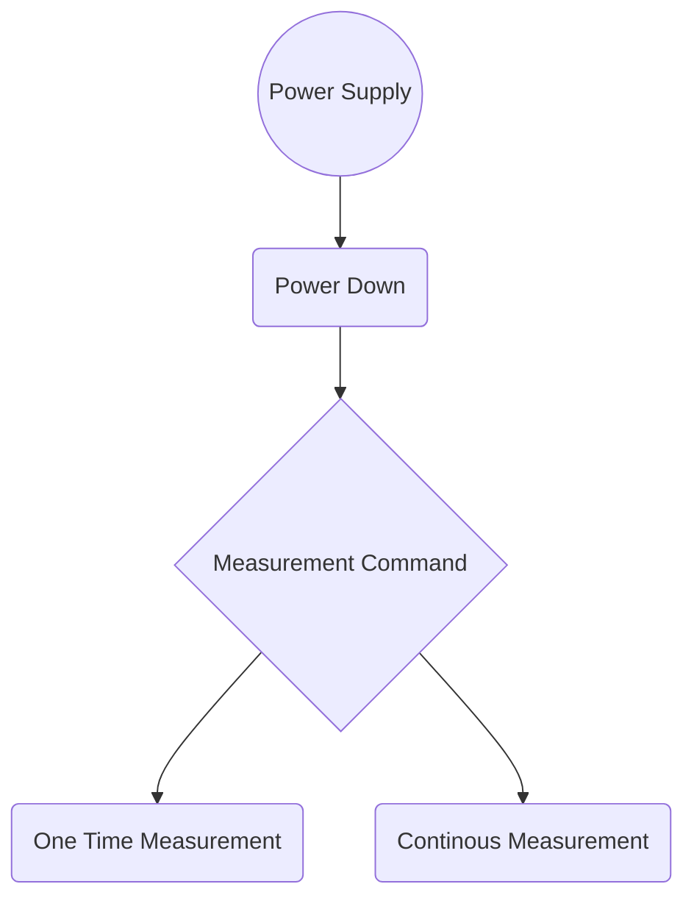
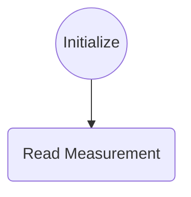

# BH1750 Rojo library

This library will help you programming the sensor BH1750 on the STM32 CUbe IDE that it's a sensor with an I2C driver and some
logic inside him. 

**This software is not an Arduino library**

# About the sensor
*All these data is in the datasheet of the sensor*

*For more information please check the BH1750FVI datasheet*

**Features**

1) I2C bus Interface ( f / s Mode Support )
2) Spectral responsibility is approximately human eye response
3) Illuminance to Digital Converter
4) Wide range and High resolution. ( 1 - 65535 lx )
5) Low Current by power down function
6) 50Hz / 60Hz Light noise reject-function
7) 1.8V Logic input interface
8) No need any external parts
9) Light source dependency is little. ( ex. Incandescent Lamp. Fluorescent Lamp. Halogen Lamp. White LED. Sun Light )
10) It is possible to select 2 type of I2C slave-address.
11) Adjustable measurement result for influence of optical window
( It is possible to detect min. 0.11 lx, max. 100000 lx by using this function. )
12) Small measurement variation (+/- 20%)
13) The influence of infrared is very small.

**Modes table**

|Measurement mode  |Measurement Time|Resolution |
|------------------|----------------|-----------|
|H-Resolution Mode2|Typical 120ms |0.5 **lx** |
|H-Resolution Mode |Typical 120ms |1 **lx**   |
|L-Resolution Mode |Typical 16ms  |4 **lx**   |

**Instruction set**

|Instruction    |Opecode    |   Comments |
|------------------|----------------|-----------|
|Power Down|`0000_0000` |No active state.|
|Power On |`0000_0001` |Waiting for measurement command.|
|Reset |`0000_0111`|Reset Data register value. Reset command is not acceptable in Power Down mode.|
|Continuously H-Resolution Mode|`0001_0000` |Start measurement at 1lx resolution. Measurement Time is typically 120ms.|
|Continuously H-Resolution Mode2|`0001_0001` |Start measurement at 0.5lx resolution. Measurement Time is typically 120ms.|
|Continuously L-Resolution Mode|`0001_0011` |No active state.|
|One Time H-Resolution Mode|`0010_0000` |Start measurement at 1lx resolution. Measurement Time is typically 120ms. It is automatically set to Power Down mode after measurement.|
|One Time H-Resolution Mode2|`0010_0001` |Start measurement at 0.5lx resolution. Measurement Time is typically 120ms. It is automatically set to Power Down mode after measurement.|
|One Time L-Resolution Mode|`0010_0011`|Start measurement at 4lx resolution. Measurement Time is typically 16ms. It is automatically set to Power Down mode after measurement.
|Change Measurement time (High bit)|`01000_MT[7,6,5]`|Change measurement time. ※ Please refer "adjust measurement result for influence of optical window. (datasheet)"
|Change Masurement time(Low bit)|`011_MT[4,3,2,1,0]`|Change measurement time. ※ Please refer "adjust measurement result for influence of optical window. (datasheet)"
※ Don't input the other opecode.

**Native Reduced Measurement Procedure**


**Library Measure Procedure**


**BH1750 Block Diagram**


**Block Diagram Descriptions**

* *PD*
  Photo diode with approximately human eye response.
* *AMP*
Integration-OPAMP for converting from PD current to Voltage.
* *ADC*
AD converter for obtainment Digital 16bit data.
* *Logic + I2C Interface*
Ambient Light Calculation and I2C BUS Interface. It is including below register.
Data Register → This is for registration of Ambient Light Data. Initial Value is "0000_0000_0000_0000".
Measurement Time Register → This is for registration of measurement time. Initial Value is "0100_0101".
* *OSC*
Internal Oscillator ( typ. 320kHz ). It is CLK for internal logic.

*All these information was taken from the BH1750FVI datasheet, for further information go to the [datasheet](https://datasheetspdf.com/pdf-file/679289/Rohm/BH1750FVI/1)*

# Sample code of basic use
**For STM32F103C8T6**
```c  
#include "main.h"
#include "Rojo_BH1750.h"
#include <stdio.h>
#include <string.h>
#include <stdint.h>

I2C_HandleTypeDef hi2c1;

void SystemClock_Config(void);
static void MX_GPIO_Init(void);
static void MX_I2C1_Init(void);

Rojo_BH1750 BH1750; //Declaration of the sensor structure
float Measure; //Variable that contains the result

int main(void)
{
  HAL_Init();
  SystemClock_Config();
  MX_GPIO_Init();
  MX_I2C1_Init();
  BH1750_Init(&BH1750, &hi2c1, Address_Low); //Initializes with the pin "ADDR" in low
  BH1750_SetResolution(&BH1750, Medium_Res); //Put your value of res
  //Remember use a resolution in "BH1750_Resolutions" enumeration defined in the header file
  while (1)
  {
	  BH1750_Read(&BH1750, &Measure);
	  //By here you are able to read the values of the sensor
	  //It is not necessary to put a delay instruction because the funcion have it
  }
}
```

# Compatible MCU's

- Bluepill Microcontrollers
	- STM32F103C8T6
	- STM32F103C6T6
	- STM32F103C8T6R
	- STM32F103C6T6A
	
- Blackpill Microcontrollers
	- STM32F401CEU6 - **Not tested**
	- STM32F411CEU6 - **Not tested**


# Code ready to copy
```c 
//Variables
Rojo_BH1750 BH1750; //Declaration of the sensor structure
float Measure; //Variable that will contain the result of the measure

//Main function
BH1750_Init(&BH1750, &hi2c1, Address_Low); //Initializes with the pin "ADDR" in low
BH1750_SetResolution(&BH1750, Medium_Res); //Put your value of res
  
//Infinite loop (while(1))
BH1750_Read(&BH1750, &Measure);
``` 
* Remember that the read function have the necessary delays and it's not recommended to put more delays just for this command

**By Pedro Rojo**

**This software is under the terms of [Mozilla Public License 2.0](https://spdx.org/licenses/MPL-2.0.html)**

# Patch Notes 0.1.0b

Launch release!!

**Any bug report, send it to pedroeroca@outlook.com**